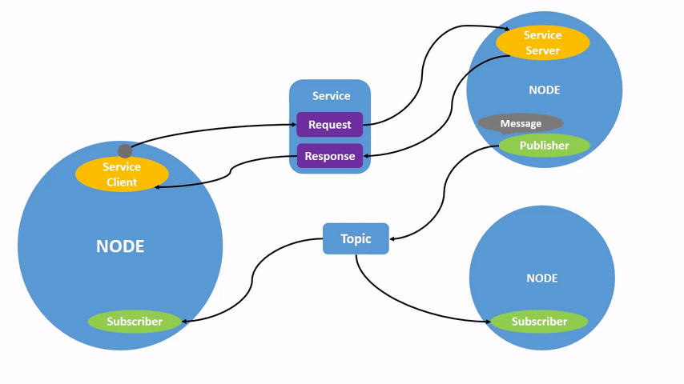

[Ros Commandline arguments](https://design.ros2.org/articles/ros_command_line_arguments.html#name-remapping-rules)

# [Beginner CLI Tools](http://docs.ros.org/en/humble/Tutorials/Beginner-CLI-Tools.html#)

1. [Configure Environment](http://docs.ros.org/en/humble/Tutorials/Beginner-CLI-Tools/Configuring-ROS2-Environment.html)

Source :

```
source /opt/ros/humble/setup.bash
```

2. [Using turtlesim and rqt](http://docs.ros.org/en/humble/Tutorials/Beginner-CLI-Tools/Introducing-Turtlesim/Introducing-Turtlesim.html)

Install : 
```
sudo apt update

sudo apt install ros-humble-turtlesim
```

example to run ros2 node:

```
ros2 run turtlesim turtlesim_node
```

```
ros2 run <package_name> <package_node>
```

Install rqt:
```
sudo apt update

sudo apt install ~nros-humble-rqt*
```

To run rqt:
```
rqt
```

3. [Ros2 Nodes](http://docs.ros.org/en/humble/Tutorials/Beginner-CLI-Tools/Understanding-ROS2-Nodes/Understanding-ROS2-Nodes.html)



Node list:
```
ros2 node list
```

Node info:
```
ros2 node info <node_name>
```

Remapping

Remapping allows you to reassign default node properties, like node name, topic names, service names, etc., to custom values.
Name remapping rules:

Remapping rules may be introduced using the --remap/-r option. This option takes a single from:=to remapping rule.

As an example, to remap from foo to bar for some_ros_executable, one may execute:
```
ros2 run some_package some_ros_executable --ros-args --remap some_node:foo:=bar
```
4. [Ros2 Topics](http://docs.ros.org/en/humble/Tutorials/Beginner-CLI-Tools/Understanding-ROS2-Topics/Understanding-ROS2-Topics.html)


rqt graph:
```
rqt_graph
```

ros2 topic list:
```
ros2 topic list -t
```

ros2 topic echo:
```
ros2 topic echo <topic_name>
```

ros2 topic info
```
ros2 topic info <topic_name>
```
ros2 interface show:
```
ros2 interface show <msg type>
```
ros2 topic publish :
The '<args>' argument is the actual data you’ll pass to the topic. It’s important to note that this argument needs to be input in YAML syntax. 
```
ros2 topic pub <topic_name> <msg_type> '<args>'
```
additional tags:
```
--once (publish once), --rate 1(1 hz frequency)
```
example msg type:
```
linear:
  x: 2.0
  y: 0.0
  z: 0.0
angular:
  x: 0.0
  y: 0.0
  z: 0.0
  ---
```

```
ros2 topic pub --once /turtle1/cmd_vel geometry_msgs/msg/Twist "{linear: {x: 2.0, y: 0.0, z: 0.0}, angular: {x: 0.0, y: 0.0, z: 1.8}}"
```

rate at which data is published:
```
ros2 topic hz <topic_name>
```
5. [Services](http://docs.ros.org/en/humble/Tutorials/Beginner-CLI-Tools/Understanding-ROS2-Services/Understanding-ROS2-Services.html)

Services are another method of communication for nodes in the ROS graph. Services are based on a call-and-response model, versus topics’ publisher-subscriber model. While topics allow nodes to subscribe to data streams and get continual updates, services only provide data when they are specifically called by a client.

ros2 service list:
```
ros2 service list
```
To see the types of all the active services at the same time, you can append the --show-types option, abbreviated as -t, to the list command
```
ros2 service list -t
```
Find service type:
```
ros2 service type <service_name>
```
find all the services of a specific type
```
ros2 service find <type_name>
```
eg :
```
Service    Type
/spawn [turtlesim/srv/Spawn]
````

Service -> Type.

To see the arguments in a Service. ros interface show:
```
ros2 interface show <type_name>
```

to find a service’s type, and how to find the structure of that type’s arguments, you can call a service using
```
ros2 service call <service_name> <service_type> <arguments>
```
arguments part is optional

6. [Ros2 parameters](http://docs.ros.org/en/humble/Tutorials/Beginner-CLI-Tools/Understanding-ROS2-Parameters/Understanding-ROS2-Parameters.html)

rosparam list:
```
ros2 param list
```
display the type and current value of a parameter
```
ros2 param get <node_name> <parameter_name>
```

change a parameter’s value at runtime
```
ros2 param set <node_name> <parameter_name> <value>
```
view all of a node’s current parameter values:
```
ros2 param dump <node_name>
```
The command prints to the standard output (stdout) by default but you can also redirect the parameter values into a file to save them for later. (use:  > ./file_name to save the output. This will be the parameter file.)

load parameters from a file to a currently running node
```
ros2 param load <node_name> <parameter_file>
```

start the same node using your saved parameter values
```
ros2 run <package_name> <executable_name> --ros-args --params-file <file_name>
```

7. [Actions](http://docs.ros.org/en/humble/Tutorials/Beginner-CLI-Tools/Understanding-ROS2-Actions/Understanding-ROS2-Actions.html)

Actions are one of the communication types in ROS 2 and are intended for long running tasks. They consist of three parts: a goal, feedback, and a result.

Actions are built on topics and services. Their functionality is similar to services, except actions can be canceled. They also provide steady feedback, as opposed to services which return a single response.

Actions use a client-server model, similar to the publisher-subscriber model (described in the topics tutorial). An “action client” node sends a goal to an “action server” node that acknowledges the goal and returns a stream of feedback and a result.


Ros2 action list with type:
```
ros2 action list -t
```

Info:
```
ros2 action info <action_name>
```

Ros2 action send goal:
```
ros2 action send_goal <action_name> <action_type> <values>
```
values need to be in YAML format. eg: "{theta: 1.57}".
To see the feedback of this goal, add --feedback


8. [rqt_console](http://docs.ros.org/en/humble/Tutorials/Beginner-CLI-Tools/Using-Rqt-Console/Using-Rqt-Console.html)

To open :
```
ros2 run rqt_console rqt_console
```

9. [Launching Nodes](http://docs.ros.org/en/humble/Tutorials/Beginner-CLI-Tools/Launching-Multiple-Nodes/Launching-Multiple-Nodes.html)

```
ros2 launch <Pkg_name> <launchnode_name>
```

10. [Recoding Data](http://docs.ros.org/en/humble/Tutorials/Beginner-CLI-Tools/Recording-And-Playing-Back-Data/Recording-And-Playing-Back-Data.html)

To Install:
```
sudo apt-get install ros-humble-ros2bag \
ros-humble-rosbag2-storage-default-plugins
```

To Record:
```
ros2 bag record <topic_name>
```

To Record Multiple topics:
```
ros2 bag record -o subset <topic_one> <topic_two>
```
The -o option allows you to choose a unique name for your bag file. The following string, in this case subset, is the file name.

Ros bag info:
```
ros2 bag info <bag_file_name>
```
Ros bag play:
```
ros2 bag play subset
```

[Beginner Client Libraries](http://docs.ros.org/en/humble/Tutorials/Beginner-Client-Libraries.html)

1. [Colcon Build](http://docs.ros.org/en/humble/Tutorials/Beginner-Client-Libraries/Colcon-Tutorial.html)

Compared to catkin there is no devel directory. **colcon does out of source builds**. ament_cmake do not support the concept of the devel space and require the package to be installed.colcon supports the option --symlink-install. This allows the installed files to be changed by changing the files in the source space

Install colcon:
```
sudo apt install python3-colcon-common-extensions
```

Colcon Build
```
colcon build --symlink-install
```

```
colcon build --packages-select my_package
```

**Check args for upto and et al**

Directory Structure
```
.
├── build
├── install
├── log
└── src

4 directories, 0 files
```
To run Tests:
```
colcon test
```
To see test results:
```
colcon test-result --verbose
```
Install setup:
```
. install/setup.bash
````
**Source the workspace**

# [Logging Levels](http://docs.ros.org/en/humble/Tutorials/Beginner-CLI-Tools/Using-Rqt-Console/Using-Rqt-Console.html)

```
There is no exact standard for what each level indicates, but it’s safe to assume that:
    Fatal messages indicate the system is going to terminate to try to protect itself from detriment.
    Error messages indicate significant issues that won’t necessarily damage the system, but are preventing it from functioning properly.
    Warn messages indicate unexpected activity or non-ideal results that might represent a deeper issue, but don’t harm functionality outright.
    Info messages indicate event and status updates that serve as a visual verification that the system is running as expected.
    Debug messages detail the entire step-by-step process of the system execution.
```

The default level is Info. You will only see messages of the default severity level and more-severe levels.

Normally, only Debug messages are hidden because they’re the only level less severe than Info. For example, if you set the default level to Warn, you would only see messages of severity Warn, Error, and Fatal.

Setting default log levels:
```
ros2 run <Package_name> <node_name> --ros-args --log-level WARN
```

# [Creating Package](http://docs.ros.org/en/humble/Tutorials/Beginner-Client-Libraries/Creating-Your-First-ROS2-Package.html)

To Create a Node Package:
```
ros2 pkg create --build-type ament_cmake --node-name my_node my_package
```
For package cpp_srvcli interface :
```
ros2 pkg create --build-type ament_cmake cpp_srvcli --dependencies rclcpp example_interfaces
```
# [Writing a simple publisher and subscriber](http://docs.ros.org/en/humble/Tutorials/Beginner-Client-Libraries/Writing-A-Simple-Cpp-Publisher-And-Subscriber.html)

To add a dependency to package.xml example:
```
<depend>rclcpp</depend>
<depend>std_msgs</depend>
```

Changes to CMakeLists.txt:

Below the existing dependency find_package(ament_cmake REQUIRED)

```
find_package(rclcpp REQUIRED)
find_package(std_msgs REQUIRED)
```

Adding executable:
```
add_executable(talker src/publisher_member_function.cpp)
ament_target_dependencies(talker rclcpp std_msgs)
add_executable(listener src/subscriber_member_function.cpp)
ament_target_dependencies(listener rclcpp std_msgs)
```

Adding install targets: 
```
install(TARGETS
  talker
  listener
  DESTINATION lib/${PROJECT_NAME})
```

Reference CMakeLists.txt:

```
cmake_minimum_required(VERSION 3.5)
project(cpp_pubsub)
# Default to C++14
if(NOT CMAKE_CXX_STANDARD)
  set(CMAKE_CXX_STANDARD 14)
endif()
if(CMAKE_COMPILER_IS_GNUCXX OR CMAKE_CXX_COMPILER_ID MATCHES "Clang")
  add_compile_options(-Wall -Wextra -Wpedantic)
endif()
find_package(ament_cmake REQUIRED)
find_package(rclcpp REQUIRED)
find_package(std_msgs REQUIRED)
add_executable(talker src/publisher_member_function.cpp)
ament_target_dependencies(talker rclcpp std_msgs)
install(TARGETS
  talker
  DESTINATION lib/${PROJECT_NAME})
ament_package()
```

**Resolve dependecies, build, install and source**

# [Writing a simple service and client (C++)](http://docs.ros.org/en/humble/Tutorials/Beginner-Client-Libraries/Writing-A-Simple-Cpp-Service-And-Client.html)

When nodes communicate using services, the node that sends a request for data is called the client node, and the one that responds to the request is the service node. The structure of the request and response is determined by a .srv file.

Default Cmake lists: **Remember to modify and mention build dependenies in package.xml**
```
cmake_minimum_required(VERSION 3.5)
project(cpp_srvcli)
find_package(ament_cmake REQUIRED)
find_package(rclcpp REQUIRED)
find_package(example_interfaces REQUIRED)
add_executable(server src/add_two_ints_server.cpp)
ament_target_dependencies(server
  rclcpp example_interfaces)
add_executable(client src/add_two_ints_client.cpp)
ament_target_dependencies(client
  rclcpp example_interfaces)
install(TARGETS
  server
  client
  DESTINATION lib/${PROJECT_NAME})
ament_package()
```

# [Creating Custom msg and srv](http://docs.ros.org/en/humble/Tutorials/Beginner-Client-Libraries/Custom-ROS2-Interfaces.html)

To convert the interfaces you defined into language-specific code (like C++ and Python) so that they can be used in those languages, add the following lines to CMakeLists.txt

```
find_package(geometry_msgs REQUIRED)
find_package(rosidl_default_generators REQUIRED)
rosidl_generate_interfaces(${PROJECT_NAME}
  "msg/Num.msg"
  "msg/Sphere.msg"
  "srv/AddThreeInts.srv"
  DEPENDENCIES geometry_msgs # Add packages that above messages depend on, in this case geometry_msgs for Sphere.msg
)
```

Package Xml:
```
<depend>geometry_msgs</depend>
<build_depend>rosidl_default_generators</build_depend>
<exec_depend>rosidl_default_runtime</exec_depend>
<member_of_group>rosidl_interface_packages</member_of_group>
```

# [Ros2 Interfaces](http://docs.ros.org/en/humble/Concepts/About-ROS-Interfaces.html)

## Setting multiple interfaces
```
set(msg_files
  "msg/Message1.msg"
  "msg/Message2.msg"
  # etc
  )
set(srv_files
  "srv/Service1.srv"
  "srv/Service2.srv"
   # etc
  )
  ```
  **[Implementing Custom Interfaces](http://docs.ros.org/en/humble/Tutorials/Beginner-Client-Libraries/Single-Package-Define-And-Use-Interface.html)**

  The following CMake code is only required when you want to use interfaces in the same package as the one in which they are used.
  ```
rosidl_get_typesupport_target(cpp_typesupport_target
  ${PROJECT_NAME} "rosidl_typesupport_cpp")
target_link_libraries(publish_address_book "${cpp_typesupport_target}")
  ```

Ros2 param Description
```
ros2 param describe /minimal_param_node my_parameter
```

Launch File syntax:
```
from launch import LaunchDescription
from launch_ros.actions import Node
def generate_launch_description():
    return LaunchDescription([
        Node(
            package="cpp_parameters",
            executable="minimal_param_node",
            name="custom_minimal_param_node",
            output="screen",
            emulate_tty=True,
            parameters=[
                {"my_parameter": "earth"}
            ]
        )
    ])
```

Include CMakeLists.txt:
```
install(
  DIRECTORY launch
  DESTINATION share/${PROJECT_NAME}
)
```

# [Ros_Doctor](http://docs.ros.org/en/humble/Tutorials/Beginner-Client-Libraries/Getting-Started-With-Ros2doctor.html)
```
ros2 doctor --report
```
# [Creating and using Plugins](http://docs.ros.org/en/humble/Tutorials/Beginner-Client-Libraries/Pluginlib.html)

Install Plugin Lib
```
sudo apt-get install ros-humble-pluginlib
```

With pluginlib, a constructor without parameters is required for classes so, if any parameters are required, we use the initialize method to initialize the object.

following lines after the ament_target_dependencies command.
```
install(
  DIRECTORY include/
  DESTINATION include
)
```

 add this command before the ament_package command

 ```
ament_export_include_directories(
  include
)
 ```
Plugin declration Xml:
 ```
 <library path="polygon_plugins">
  <class type="polygon_plugins::Square" base_class_type="polygon_base::RegularPolygon">
    <description>This is a square plugin.</description>
  </class>
  <class type="polygon_plugins::Triangle" base_class_type="polygon_base::RegularPolygon">
    <description>This is a triangle plugin.</description>
  </class>
</library>
```
A couple things to note:

    The library tag gives the relative path to a library that contains the plugins that we want to export. In ROS 2, that is just the name of the library. In ROS 1 it contained the prefix lib or sometimes lib/lib (i.e. lib/libpolygon_plugins) but here it is simpler.

    The class tag declares a plugin that we want to export from our library. Let’s go through its parameters:

        type: The fully qualified type of the plugin. For us, that’s polygon_plugins::Square.

        base_class: The fully qualified base class type for the plugin. For us, that’s polygon_base::RegularPolygon.

        description: A description of the plugin and what it does.

        name: There used to be a name attribute, but it is no longer required.

following block to your ros2_ws/src/polygon_plugins/CMakeLists.txt after the line reading find_package(pluginlib REQUIRED)
```
add_library(polygon_plugins src/polygon_plugins.cpp)
target_include_directories(polygon_plugins PUBLIC
  $<BUILD_INTERFACE:${CMAKE_CURRENT_SOURCE_DIR}/include>
  $<INSTALL_INTERFACE:include>)
ament_target_dependencies(
  polygon_plugins
  polygon_base
  pluginlib
)
pluginlib_export_plugin_description_file(polygon_base plugins.xml)
install(
  TARGETS polygon_plugins
  EXPORT export_${PROJECT_NAME}
  ARCHIVE DESTINATION lib
  LIBRARY DESTINATION lib
  RUNTIME DESTINATION bin
)
```

and before the amen_package()
```
ament_export_libraries(
  polygon_plugins
)
ament_export_targets(
  export_${PROJECT_NAME}
)
```
# Run-time composition using ROS services with a publisher and subscriber

To see available components:
```
ros2 component list
```
For Demo:
```
ros2 run rclcpp_components component_container
```
```
ros2 component load /ComponentManager composition composition::Talker
ros2 component load /ComponentManager composition composition::Listener
```

# Running cpp_parameters

parameter values can be set from launchfile or cpp file or from terminal. can be launched directly ros node or use a launch file. paraeters are set differently thus parameter value initalized will have different parameters in first iteration and then changed to another default from next instance of publishing.

From launch file:
```
ros2 launch cpp_parameters cpp_parameters_launch.py
```
From Node;
```
ros2 run cpp_parameters minimal_param_node
```

To change parameter value from terminal if launched using launch file.
```
ros2 param set /Life_launch_node Declare_life_parameter Depressionfromterminal
```
To change parameter value from terminal if launched using executable node name.
```
ros2 param set /minimal_param_node Declare_life_parameter Depressionfromterminal
```

# Running ros_tutorial

The ros_tutorial package containes a publisher, which publishes to a topic Life_iteration, and another node which containes a subscriber to the topic Life_iteration
and publishes the same message to another topic called No_Life_iteration. The message is a custom generate message of 3 ints.

All the nodes are executed by a single launch file cpp_pubsub_launch.py

```
rosdep install -i --from-path src --rosdistro humble -y
colcon build
. install/setup.bash
ros2 launch ros_tutorial cpp_pubsub_launch.py
```
In a new terminal, source it and run to see the message in the new topic.
```
ros2 topic echo /No_Life_iteration
```

# Running serverpublisher package

Tha package has three nodes, one simple publisher publishes to topic Life_iteration 3 ints. 
The other executable subscribes to this topic, and creates a client and waits for the service. once service sends a response, the accepts publishes the three ints to another topic called No_life_iteration. 
To run the launch file:

```
rosdep install -i --from-path src --rosdistro humble -y
colcon build
. install/setup.bash
ros2 launch serverpublisher cpp_pubsub_launch.py
```
In a new terminal, source it and run to see the message in the new topic.
```
ros2 topic echo /No_Life_iteration
```